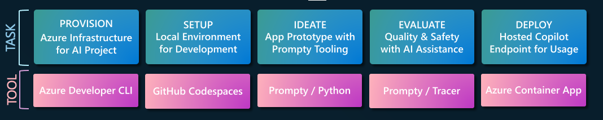

# 5. The Dev Workflow

In this workshop, we'll follow a simplified version of the development lifecycle as shown in the figure below. For each stage of our development, we'll talk about the **task** we need to perform, and the **tool** that helps us do this.

Let's briefly review what these stages are:

1. **Provision** sets up the infrastructure on Azure and deploys the initial application version to the relevant hosting resource. The Azure Developer CLI helps us achieve this with one command.
1. **Setup** focuses on establishing our development environment and configuring it to work with our provisioned infrastructure. We use Dev Containers to define the dependencies, launch it from GitHub Codespaces, then authenticate with Azure, and refresh our env variables.
1. **Ideate**